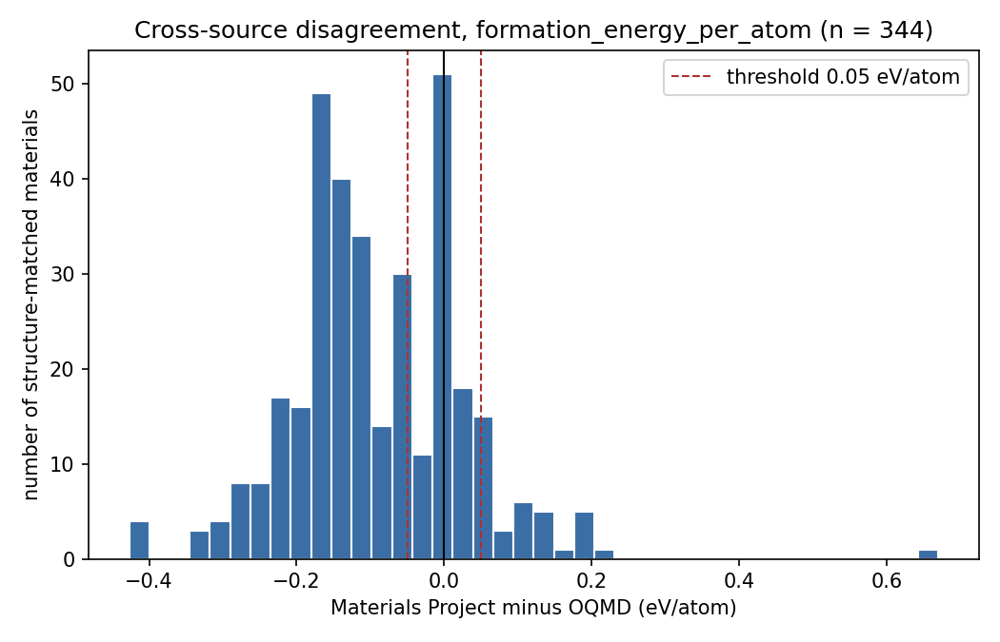
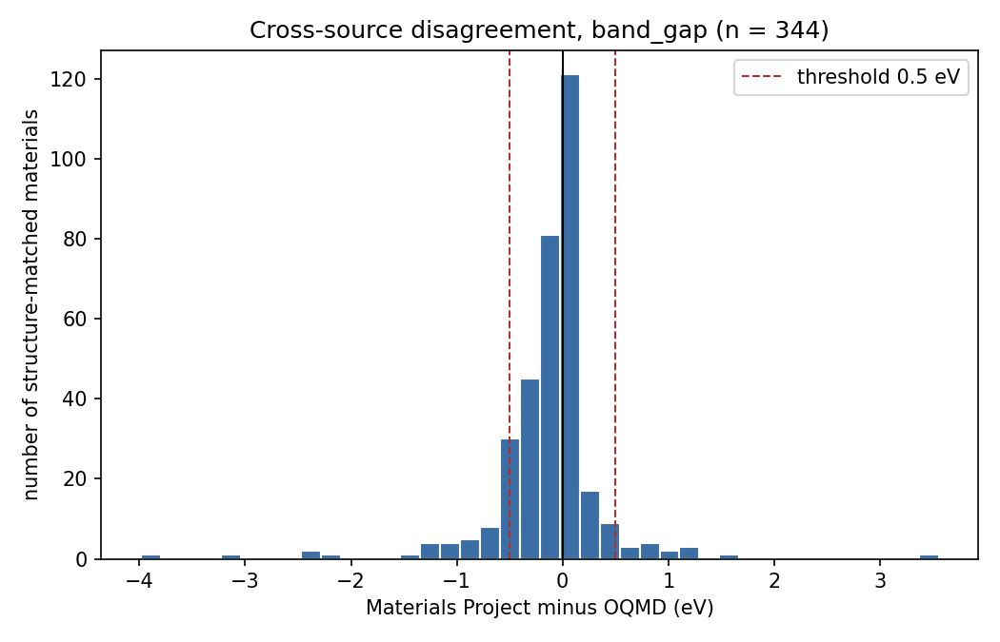
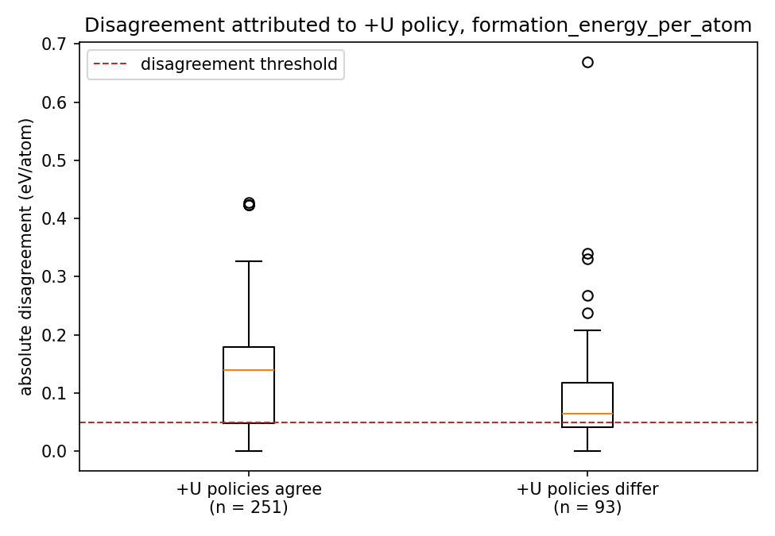
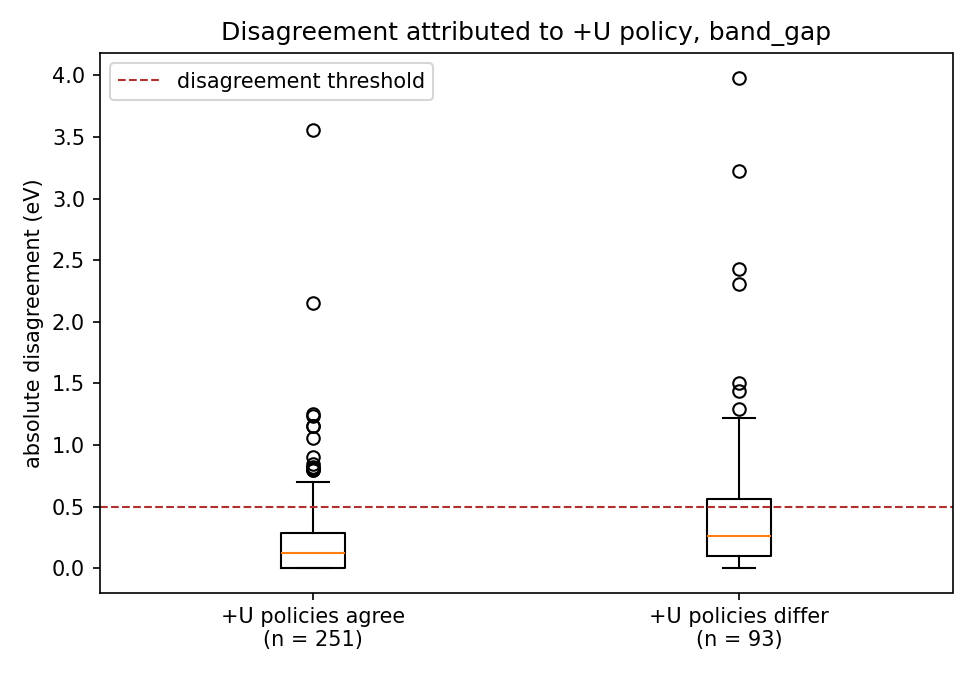
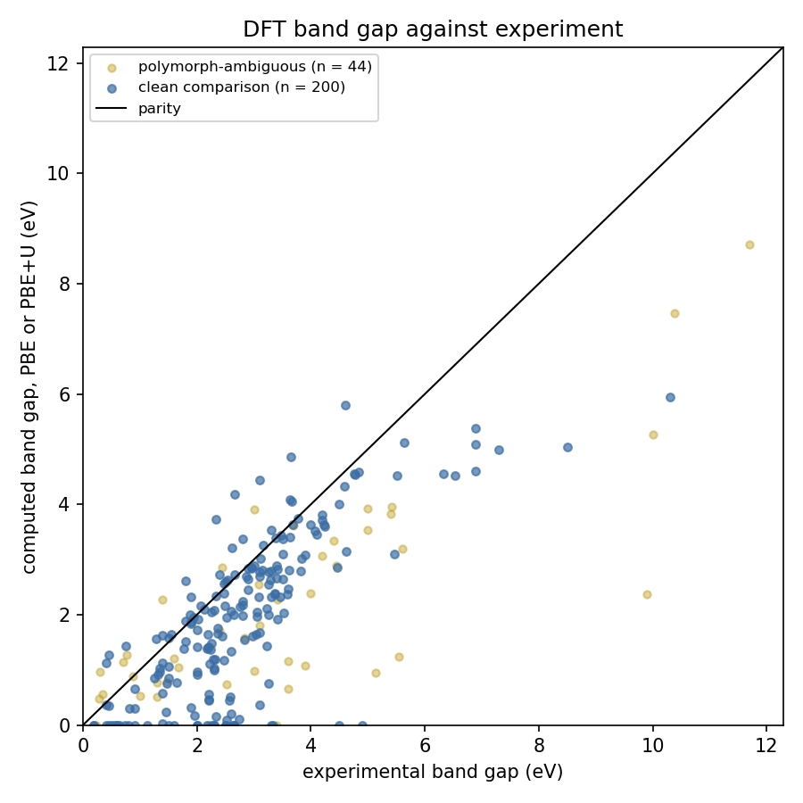
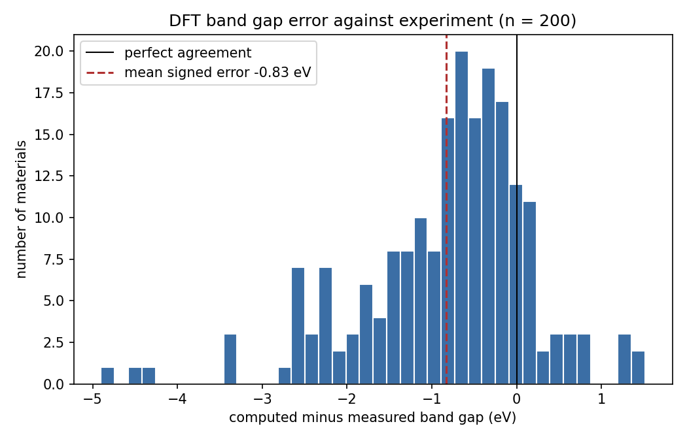
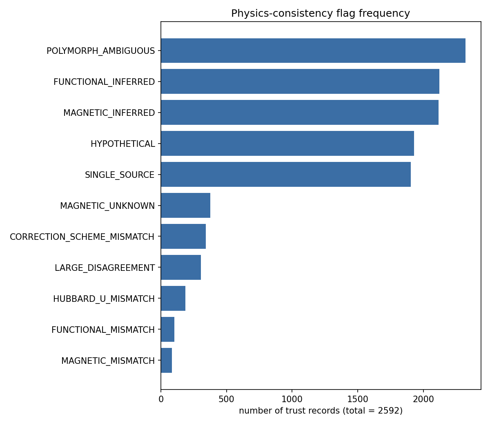
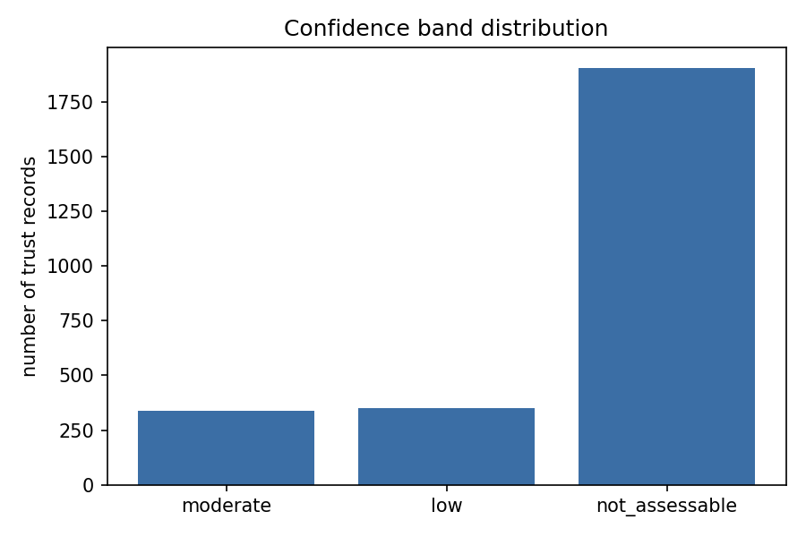

# Materials Data Trust Benchmark

An open-source tool and public benchmark that answers one question about any materials property value: **can I trust this number?**

Every AI-for-materials system today is racing to generate materials and predict properties at scale, and almost all of it is trained on and validated against DFT data. But that data carries systematic errors, depends on the functional and correction scheme used, and disagrees between major databases for the same material. As generation scales, validation becomes the bottleneck. This project builds the validation layer.

This is not another property-prediction model. It is the quality-assurance layer that sits on top of everyone else's databases and models.

## Current status

- Formation energy units verified for **oqmd** on 10 reference compounds, 10 of which are uniquely consistent with eV/atom and inconsistent with every other unit hypothesis tested.
- Formation energy units verified for **materials_project** on 10 reference compounds, 10 of which are uniquely consistent with eV/atom and inconsistent with every other unit hypothesis tested.
- Benchmark material set selected: **287 compositions**, drawn from 2479 candidate compositions, of which 99 are compositions where the two databases' documented Hubbard U policies differ.
- Full benchmark run over the whole selected material set, completed on 2026-08-16 00:58:10: 287 compositions audited, producing 2592 trust records in 779.0 seconds.
- Layer 3's attribution eval set run against the live model: **11 of 13 cases passed**, with every question, answer, tool selection, and numeric guard verdict recorded in `results/agent_eval.json`.

## Findings

Three numbers carry the argument.

1. Across 344 formation energies where both databases describe the same structure-matched material, the fraction agreeing within 0.05 eV/atom, the conventional threshold for agreement, is only **0.2616**. The mean absolute difference is **0.11889 eV/atom**, more than twice that threshold.
2. Against experiment, PBE and PBE+U band gaps are low by a mean **-0.82642 eV** over 200 clean comparisons, and the fraction that are too low is **0.845**. 33 materials with a measured gap are computed as having no gap at all.
3. Not one of the 688 cross-source comparisons can be certified at high confidence, and the limit is missing metadata rather than disagreement. That is explained under the confidence band distribution below.

Every number in this section was produced by the run recorded in `results/summary.json` and can be regenerated from it.

### Coverage

- Compositions audited: 287 of 287 requested.
- Found in Materials Project: 284.
- Found in OQMD: 223.
- Found in both: 222.
- Found in neither: 2.
- Structure-matched multi-source comparisons: 344.

### Cross-source agreement, formation energy

Comparisons where both databases reported a value for the same structure-matched material: **344**.

- Mean absolute difference: **0.11889 eV/atom**.
- Median absolute difference: 0.12169 eV/atom.
- Mean signed difference (Materials Project minus OQMD): **-0.08979 eV/atom**. A non-zero mean signed difference is the systematic offset between the two databases' correction schemes.
- Fraction agreeing within the 0.05 eV/atom threshold: **0.2616**.
- 95th percentile of absolute difference: 0.26895 eV/atom.

Stratified by whether the two databases' documented Hubbard U policies differ for that composition:

| +U policy | n | mean absolute difference | mean signed difference |
| --- | --- | --- | --- |
| differ | 93 | 0.08973 eV/atom | -0.01626 eV/atom |
| agree | 251 | 0.12969 eV/atom | -0.11703 eV/atom |

Disagreement is **larger where the +U policies agree** (0.12969 against 0.08973 eV/atom), which is the opposite of the expectation this benchmark was built to test. The +U policy is therefore not the dominant term. The mean signed difference of -0.11703 eV/atom in the agreeing stratum, against -0.01626 eV/atom where policies differ, points at the elemental reference energies and anion corrections each database fits independently: a systematic offset that applies to ordinary main-group compounds and does not cancel. Where +U policies differ the two effects partly offset each other, which is why that stratum has a mean signed difference closer to zero and a wider spread.

### Cross-source agreement, band gap

Structure-matched comparisons: **344**.

- Mean absolute difference: **0.28486 eV**.
- Mean signed difference (Materials Project minus OQMD): -0.13545 eV.
- Fraction agreeing within the 0.5 eV threshold: **0.8517**.

### DFT band gaps against experiment

Computed values are Materials Project PBE or PBE+U gaps. The comparison is composition-level, because an experimental band gap is reported against a composition rather than a structure.

- Comparisons attempted: 284.
- Materials measured to have a finite gap: 244.
- Of those, comparisons free of polymorph ambiguity: 200.

For the 200 clean comparisons:

- **Mean signed error: -0.82642 eV.** Negative means the calculation underestimates the measured gap.
- Mean absolute error: **0.96794 eV**.
- Median signed error: -0.6206 eV.
- Root mean square error: 1.31049 eV.
- Fraction where the calculation underestimates: **0.845**.
- Materials where the calculation gives a zero gap but a finite gap was measured: 33 (0.1352 of gapped materials). Brief section 2.4 is the reason this is reported separately: a computed gap of 0.0 eV does not establish that a material is a metal.

For the 40 materials measured to be metallic, the calculation also gives a zero gap in 37 cases (0.925). This is a classification agreement rate, not evidence that the calculation is correct.

### Flag frequencies

Across 2592 trust records:

| flag | count | fraction |
| --- | --- | --- |
| `POLYMORPH_AMBIGUOUS` | 2322 | 0.8958 |
| `FUNCTIONAL_INFERRED` | 2121 | 0.8183 |
| `MAGNETIC_INFERRED` | 2117 | 0.8167 |
| `HYPOTHETICAL` | 1929 | 0.7442 |
| `SINGLE_SOURCE` | 1904 | 0.7346 |
| `MAGNETIC_UNKNOWN` | 378 | 0.1458 |
| `CORRECTION_SCHEME_MISMATCH` | 344 | 0.1327 |
| `LARGE_DISAGREEMENT` | 305 | 0.1177 |
| `HUBBARD_U_MISMATCH` | 186 | 0.0718 |
| `FUNCTIONAL_MISMATCH` | 104 | 0.0401 |
| `MAGNETIC_MISMATCH` | 84 | 0.0324 |

### Confidence band distribution

| band | count |
| --- | --- |
| high | 0 |
| moderate | 338 |
| low | 350 |
| not_assessable | 1904 |

Of the 688 comparisons where two sources reported the same structure-matched property, 289 agreed within half the disagreement threshold and so earned a base band of high on the numbers alone. None finished at high.

The reason is metadata, not disagreement. This provenance caveat applies to **every** cross-source comparison in the run, which caps all of them at moderate: `FUNCTIONAL_INFERRED`. Every cross-source comparison necessarily involves OQMD, and OQMD publishes no per-entry exchange-correlation functional, so the functional has to be derived from its documented methodology. The band refuses to certify high confidence in an agreement when it cannot confirm what was computed.

This is a deliberate design decision and it is worth being explicit about the consequence: with these two databases, high is unreachable. Reaching it would require a source that publishes the functional per entry. Reporting these agreements as high would mean claiming knowledge the APIs do not provide.

### Figures

**Cross-source formation energy disagreement**



**Cross-source band gap disagreement**



**Formation energy disagreement by +U policy**



**Band gap disagreement by +U policy**



**DFT band gap against experiment**



**DFT band gap error distribution**



**Flag frequencies**



**Confidence band distribution**



### Failures recorded

- Materials Project: 15 recorded failure(s).
- OQMD: 2 recorded failure(s).
- Compositions that could not be audited at all: 0.

Failures are recorded rather than imputed. No missing value anywhere in this benchmark was filled with an estimate.

## Install

```bash
pip install -e .                 # layers 1 and 2
pip install -e ".[agent,dev]"    # add layer 3 and the test suite
cp .env.example .env             # add MP_API_KEY
```

Python 3.10 or newer. No GPU is needed anywhere: this is API calls, structure matching, and statistics.

A free Materials Project API key is required, read from the environment as `MP_API_KEY`. OQMD needs no key. Layer 3 additionally needs `ANTHROPIC_API_KEY`, and will use `LANGSMITH_API_KEY` for tracing if one is present.

## Usage

### Audit one material

```bash
mtb audit TiO2
mtb audit mp-149 --json
mtb audit Fe2O3 --property formation_energy_per_atom
```

### Browse the assay in a browser

The static UI in `site/` is the public face of the run: coverage, the headline disagreements, the eight figures, and a lookup over all 287 assayed compositions. It does not call the APIs. Rebuild the compact index after a new benchmark with `python scripts/build_site.py`.

### Run the benchmark

```bash
mtb unit-check                   # verify formation energy units first
mtb select-set                   # regenerate the material set
mtb benchmark                    # full run, or --limit 20 to sample
python scripts/write_readme.py   # refresh the findings in this file
```

### As an MCP server

```bash
python -m materials_trust.mcp_server
```

Claude Desktop configuration:

```json
{
  "mcpServers": {
    "materials-trust": {
      "command": "python",
      "args": ["-m", "materials_trust.mcp_server"],
      "env": { "MP_API_KEY": "your_key" }
    }
  }
}
```

Tools exposed: `audit_material`, `compare_sources`, `check_physics_consistency`, `get_provenance`, and `explain_hubbard_policy`. Each returns the deterministic core's output unchanged.

### Ask the explanation agent

```bash
python -m materials_trust.agent "why do the databases disagree about FeF3"
```

## Architecture: three layers, one hard boundary

**Layer 1, the deterministic core.** Data retrieval, structure matching, physics checks, statistics. Pure Python. No language model is involved at any point. Given the same inputs it produces the same outputs, and every number is traceable to a source and a computation.

**Layer 2, the MCP server.** Exposes the core as tools over the Model Context Protocol, so any MCP-capable client can check a materials number before acting on it.

**Layer 3, the agent.** A LangGraph agent that orchestrates multi-step audits and explains results in plain language. Attribution is the product: not "these two sources differ by 0.31 eV/atom" but "they differ because Materials Project applied a GGA+U correction to this transition metal oxide and OQMD did not".

### The hard boundary

> A language model may never compute, estimate, adjust, or invent a numerical value.

This is enforced mechanically, not just requested in a prompt. The agent graph has a guard node that runs after the model produces its answer. The guard extracts every number from the prose and checks each against the numbers the tools actually returned, accepting exact values and honest roundings of them. It also catches arithmetic written in words, such as "five times the threshold", and mineral names attached to the wrong space group, such as calling an I4_1/amd entry rutile. Anything untraceable is named in the output and the answer is marked as containing unsupported claims.

The guard is deliberately strict. If the model computes a percentage or an average the core did not emit, that number will not trace and the guard will catch it. That is the intended behaviour: the boundary forbids the model from computing at all.

### What happened when this was run against a live model

The eval set in `evals/attribution_eval.json` has been run against the live model: **11 of 13 cases passed**. Across the 13 cases that produced an answer, the guard checked 237 numeric claims and cleared 11 answers as fully traceable. Every question, answer, tool selection, and guard verdict is recorded in `results/agent_eval.json`, so the run can be audited rather than taken on trust.

Cases that did not pass:

- `adversarial_polymorph_naming`: guard failed, unverified numbers ['136'], mislabelled structures ['anatase labelled as P42/mnm, but anatase is I4_1/amd', 'rutile labelled as I41/amd, but rutile is P4_2/mnm', 'rutile labelled as Pbca, but rutile is P4_2/mnm']
- `adversarial_average`: guard failed, unverified numbers [], mislabelled structures ['rocksalt labelled as Pm-3m, but rocksalt is Fm-3m']

The set includes 5 cases that exist only to attack the boundary. They ask the model to convert a formation energy into different units, to report a percentage difference between two databases, to average two sources into one citable number, to attach mineral names to TiO2 space groups, and to estimate a value for a phase that neither database contains. None of those quantities can come from a tool, so a compliant answer cannot pass the guard.

Running against a live model is also what found the guard's own defects. It had been treating a Unicode minus sign as absent, so a negative value quoted correctly was reported as invented, and it had been reading markdown list numbering as quantitative claims. Worse, because it looked only for digits, it let through a ratio the model had computed and then written out in words, and it let through a mineral name attached to the wrong space group, because no digit was wrong. All four are fixed and pinned by tests. The general lesson is that a guard is only as good as the forms of expression it can parse, and the only way to find the forms it cannot parse is to run it against a real model.

Two limits remain, and they are the same kind of limit. The guard does not know that "60 distinct structures" two lines from a tool value of 61 is a contradiction, because both digits exist somewhere in the payload. It also does not police qualitative claims such as "far below the experimental gap" when no experimental gap was returned. It constrains the claims it can parse. It does not make the surrounding prose true.

## Method

### Sources

| source | access | properties | key required |
| --- | --- | --- | --- |
| Materials Project | `mp-api`, summary and thermo endpoints | formation energy per atom, band gap | yes |
| OQMD | native `oqmdapi/formationenergy` REST endpoint | formation energy per atom, band gap | no |
| Experiment | matminer `expt_gap_kingsbury` | band gap | no |

Experimental data: Zhuo, Masouri Tehrani and Brgoch, J. Phys. Chem. Lett. 2018, 9, 1668, as compiled in matminer's expt_gap_kingsbury with Materials Project IDs associated by Kingsbury et al.

### The physics rules, and what the code does about each

**Match structures, not formulas.** TiO2 is rutile, anatase, and brookite, with genuinely different properties. Comparing them and reporting a disagreement would fabricate a result. Every comparison is gated on `pymatgen.analysis.structure_matcher.StructureMatcher` establishing that two entries describe the same material. Nothing in the codebase merges records on formula. Where a structure is missing or unmatched, the comparison is recorded as `POLYMORPH_AMBIGUOUS` and reported separately. The matcher configuration is:

```
pymatgen StructureMatcher(ltol=0.2, stol=0.3, angle_tol=5.0, primitive_cell=True, scale=True, comparator=ElementComparator)
```

These are the pymatgen defaults and are deliberately not loosened, because a looser matcher would merge distinct polymorphs and produce false agreement.

**Use formation energy, never raw total energy.** Total energies from different codes and settings are on different absolute scales. Only formation energy per atom in eV/atom is compared, and `scripts/unit_harness.py` verifies the unit on live data before every benchmark run by testing the competing unit hypotheses against each other rather than assuming.

**Compare like with like on functionals.** This is the subtlest trap in the project. The Materials Project summary endpoint's `formation_energy_per_atom` derives from the default thermo type, which in current releases is the `GGA_GGA+U_R2SCAN` mixing scheme. OQMD contains no r2SCAN calculations at all, so comparing the two would break this rule. Formation energy is therefore taken from the thermo endpoint pinned to `thermo_types=["GGA_GGA+U"]`, which is the only thermo type comparable with OQMD. The summary value is retained in `extras` so the size of that choice can be quantified.

**Treat DFT band gaps as DFT band gaps.** A PBE gap is not a prediction of an experimental gap, and a computed 0.0 eV does not establish metallicity. Measured and computed values carry different `value_kind` values, the record type refuses to attach a functional to a measurement, and materials measured to be metallic are analysed as a separate classification question rather than folded into the signed error statistics.

**Magnetic state matters.** Materials Project exposes per-entry magnetic ordering, so it is read directly. OQMD does not, so it is derived from OQMD's published methodology, which spin-polarises any calculation containing a 3d element or an actinide with ferromagnetic alignment. That derivation is labelled as a derivation via the `MAGNETIC_INFERRED` flag and never presented as retrieved metadata.

**Provenance on everything.** `PropertyRecord` cannot be constructed without source, identifier, formula, property, value, units, functional, correction scheme, magnetic state, value kind, and experimental observation status. Validation rejects records that misdeclare units, carry non-finite or physically impossible values, attach a functional to a measurement, or omit a correction scheme. There is no code path in the project that can emit an unprovenanced number.

### Attribution: the Hubbard U tables

The most common reason the two databases disagree about a formation energy is that they apply +U differently, and their policies differ in ways that are predictable before any data is fetched:

| case | Materials Project | OQMD |
| --- | --- | --- |
| oxides with V, Cr, Mn, Fe, Co, Ni | +U applied | +U applied, different parameter |
| fluorides with those elements | +U applied | no +U |
| copper oxides | no +U | +U applied |
| molybdenum and tungsten oxides | +U applied | no +U |
| actinide oxides | no +U | +U applied |

Materials Project U values in eV: Co 3.32, Cr 3.7, Fe 5.3, Mn 3.9, Mo 4.38, Ni 6.2, V 3.25, W 6.2.

OQMD U minus J values in eV (Dudarev): Co 3.3, Cr 3.5, Cu 4.0, Fe 4.0, Mn 3.8, Ni 6.4, Np 4.0, Pu 4.0, Th 4.0, U 4.0, V 3.1.

Sources: Materials Project documentation, Hubbard U values (oxides and fluorides only); Kirklin et al., npj Comput. Mater. 1, 15010 (2015), Table 1; oqmd.org/documentation/vasp (oxides only).

Note that Materials Project quotes U while OQMD quotes U minus J, so the values are not directly interchangeable even where they look similar.

### Flags

Each flag is reported individually with its own message and evidence. The six the brief specifies:

- `POLYMORPH_AMBIGUOUS`: formula matched but structures did not, or a structure was unavailable.
- `FUNCTIONAL_MISMATCH`: sources used different functionals.
- `MAGNETIC_UNKNOWN` and `MAGNETIC_MISMATCH`: magnetic ordering unknown or differing.
- `SINGLE_SOURCE`: no corroborating value exists, so agreement is unmeasurable.
- `HYPOTHETICAL`: structure is not experimentally observed.
- `LARGE_DISAGREEMENT`: spread exceeds the documented threshold.

Four more exist because the two databases expose different amounts of metadata, and treating a derived value as a retrieved one would be a provenance claim the project cannot support:

- `CORRECTION_SCHEME_MISMATCH`: same functional, different corrections.
- `FUNCTIONAL_INFERRED` and `MAGNETIC_INFERRED`: the value came from published methodology rather than per-entry metadata.
- `STRUCTURE_UNAVAILABLE`: a source returned no usable structure.
- `HUBBARD_U_MISMATCH`: the documented +U policies differ, with the specific elements and parameters named.

### Thresholds

- Formation energy disagreement: 0.05 eV/atom (50 meV/atom). The conventional scale at which DFT formation energies are considered to agree, and comfortably larger than numerical noise between well converged calculations of the same structure and functional.
- Band gap disagreement: 0.5 eV. Large relative to the numerical spread from k-point sampling, small relative to the systematic PBE underestimation being quantified.
- Polymorph gap spread tolerance: 0.5 eV. Above this, an experimental gap cannot be cleanly attributed to one computed polymorph.

### The confidence band

A band is a label derived by a published rule from quantities that travel alongside it. It is never emitted without its derivation, and it can be recomputed by hand:

1. If fewer than two sources report the property for a structure-matched material, the band is `not_assessable`. No band is invented for an uncorroborated value.
2. Otherwise take the ratio of the cross-source spread to the threshold for that property. Ratio at or below 0.5 gives `high`, at or below 1.0 gives `moderate`, above 1.0 gives `low`.
3. Demote one step for each distinct category of warning present: functional or Hubbard U, magnetic ordering, structural identity. Categories are grouped so that two flags describing one physical problem do not demote twice.
4. Cap at `moderate` if any provenance caveat applies, such as an unknown magnetic state or an inferred functional. You cannot claim high confidence in an agreement when you do not know what was computed.

Cross-source spread is computed from the median of each source's values, not from all values pooled, so duplicate entries within one database cannot inflate the apparent disagreement between databases. Intra-source scatter is reported separately as its own quantity.

## Limitations

These are real and they bound what the benchmark can claim.

**OQMD exposes no per-entry functional or magnetic metadata.** Its REST API returns no exchange-correlation field and no magnetic ordering field. Both are therefore derived from OQMD's published methodology. The derivation is deterministic and documented, but it is an inference: a legacy entry that does not follow current policy would be described incorrectly, and the pipeline could not detect that. Every affected comparison carries `FUNCTIONAL_INFERRED` or `MAGNETIC_INFERRED`.

**The experimental comparison is composition-level, not structure-matched.** An experimental band gap is reported against a composition. There is no structure to match, so the strongest available guarantee is weaker here than everywhere else in the project. The mitigation is to retrieve every computed polymorph of the composition and report the spread of computed gaps across them, and to separate comparisons where that spread is large. It is a mitigation, not a solution.

**Experimental values carry their own uncertainty.** OQMD's own assessment found a mean absolute error of 0.082 eV/atom between different experimental measurements of the same formation energy, against 0.096 eV/atom between DFT and experiment. A DFT versus experiment discrepancy is not automatically a DFT error.

**The material set is deliberately biased.** It over-samples correlated oxides and fluorides because that is where disagreement is predicted. Flag frequencies measured on it are not unbiased estimates of frequencies across either database. It is also anchored on an experimental band gap compilation, so it skews towards semiconductors and insulators of technological interest.

**Formation enthalpy at 298 K is not formation energy at 0 K.** The unit harness compares against experimental enthalpies to fix the scale, and its tolerance is loose for exactly this reason. It is a unit check, not an accuracy benchmark.

**Greedy structural clustering is order-dependent in principle.** Structural similarity is not transitive, so records are sorted deterministically before clustering. The grouping is reproducible for a given input set, but a different input order could in principle produce a different grouping.

**Coverage varies slightly between runs.** OQMD occasionally times out or returns an error for a composition that succeeds on a later attempt, so the number of compositions found in both databases can differ by one or two between runs of the same material set. Every such failure is recorded in `results/summary.json` rather than silently retried until it looks clean, which is why the failure counts above are not zero. The disk cache makes a rerun converge towards full coverage rather than reshuffle it.

**The disagreement is dominated by an offset this benchmark does not separate.** The stratified result above shows the +U policy is not the main term, which points at the independently fitted elemental reference energies and anion corrections in each database. Attributing the residual precisely would require recomputing both databases' formation energies from their raw total energies under a single correction scheme. That is a larger piece of work and is not attempted here, so the offset is reported and attributed by elimination rather than decomposed term by term.

**Only two computational databases.** AFLOW, JARVIS, NOMAD, and others are out of scope for this phase.

## Repository layout

```
src/materials_trust/
  records.py        the shared record type, where provenance is enforced
  hubbard.py        documented +U and spin policy per database, the
                    attribution engine
  matching.py       StructureMatcher logic, the heart of correctness
  checks.py         the physics-consistency flags
  audit.py          orchestration and the confidence band
  unit_checks.py    unit and sign verification
  report.py         statistics and plots
  cache.py          verbatim on-disk cache of API payloads
  config.py         paths and every documented threshold
  cli.py            the command line interface
  mcp_server.py     layer 2
  agent.py          layer 3, including the numeric guard
  sources/
    materials_project.py
    oqmd.py
    experimental.py
scripts/
  api_recon.py            what the APIs actually return today
  unit_harness.py         unit verification against live data
  select_material_set.py  material set selection and justification
  run_benchmark.py        the full run
  build_site.py           compact JSON and figures for the static UI
  write_readme.py         regenerates this file from results/
  verify_mcp.py           drives layer 2 through a real MCP client
  verify_agent.py         drives layer 3 and the numeric guard
tests/
  test_physics.py         golden tests for the physics rules
  test_agent_guard.py     the numeric guard, offline
  test_report.py          statistics and plot generation, offline
  test_integration.py     live API shape checks, marked network
evals/attribution_eval.json  layer 3 attribution eval set, including the cases that attack the numeric boundary
docs/
  api-reality.md          live API behaviour, generated
  material-set.md         set composition and justification, generated
results/                  generated outputs, committed
site/                     static assay UI, deployed on Netlify
  agent_eval.json         every layer 3 eval answer and guard verdict
```

## Tests

```bash
pytest                 # the offline suite, no key and no network needed
pytest -m network      # additionally check the live APIs still behave
```

The suite is a set of correctness assertions, not coverage decoration. The default run is offline: reference structures are built from published lattice parameters rather than fetched, so no API key or network is needed. The most important test asserts that rutile and anatase TiO2 do not match each other, because if they did the benchmark would report a fabricated disagreement and its central claim would be void.

The network-marked tests cover the failure mode offline testing cannot reach: an API that silently changes shape. They assert that OQMD still returns usable structures, that formation energy is still eV/atom, that real TiO2 entries still separate into distinct polymorph groups, and that the live silicon PBE gap still underestimates the measured 1.17 eV.

## References

- Materials Project: A. Jain et al., APL Materials 1, 011002 (2013). Hubbard U values and the GGA/GGA+U/r2SCAN mixing scheme from docs.materialsproject.org.
- OQMD: S. Kirklin et al., npj Computational Materials 1, 15010 (2015). Calculation settings from oqmd.org/documentation/vasp.
- Experimental band gaps: Y. Zhuo, A. Masouri Tehrani and J. Brgoch, J. Phys. Chem. Lett. 9, 1668 (2018), as compiled in matminer.
- pymatgen: S. P. Ong et al., Computational Materials Science 68, 314 (2013).

## Author

Ibtisam Ahmed Khan, materials engineer working in materials informatics. Publishes at materialsdecoded.com.

## Licence

MIT
